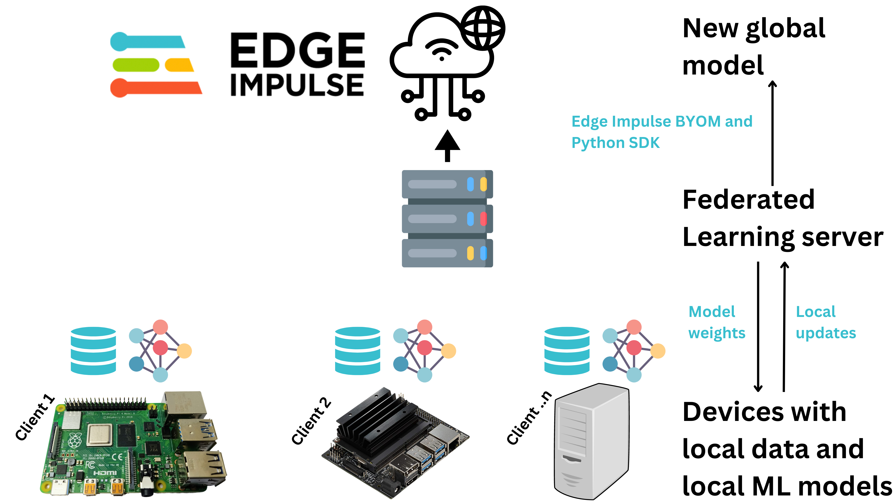

# TensorFlow Federated Learning and Edge Impulse model deployment



This repository demonstrates how to use [Flower Federated Learning](https://flower.dev/docs/framework/tutorial-what-is-federated-learning.html) to train a TensorFlow model and deploy it to a wide range of devices by using [Edge Impulse Python SDK](https://docs.edgeimpulse.com/docs/tools/edge-impulse-python-sdk).

The main characteristics of this architecture include:
- At least 2 connected devices(clients) that will individually train a local model.
- Each client holds a local dataset of training and test images. The images are different for each client.
- Server-side model parameter initialization.
- Server-side model evaluation after parameter aggregation.


## Demonstration

We simulate a situation where we have multiple Computer Vision devices that have a similar image classification problem. 

For this, we use 2 devices to train a MobileNetV2 model to classify if an image is a ```head``` or ```hardhat```. We train the image classification model with these Computer Vision devices using Federated Learning. Finally, a server takes the final updated model and uploads it to an Edge Impulse project so that we can deploy it to any device that can run it. 

There are 4 dataset folders:
- 2 folders for [client 1](datasets/dataset_client1/) and [client 2](datasets/dataset_client2/) with training and test images
- 1 [folder](datasets/dataset_server/) with the server's test images that are used to evaluate models
- 1 [folder](datasets/dataset_test/) with test images that we can give to the final global model and get its performance

## Quick Start

Ensure you have Python on the devices that you want to run the Federated Learning. The server and client devices need to be connected to the same network. These devices can be PCs, and even System-on-Chip devices like the Raspberry Pi 4. If you have Python3 you can replace ```pip``` with ```pip3``` in the commands below.

1) Start by cloning the repository on the device that will run as the server. For the client devices, we only need to copy to them the [datasets](datasets/) folder, [requirements_client.txt](requirements_client.txt) and [client.py](client.py). You can also clone the repository on the client devices, but this will load unnecessary files on them. 

```
git clone https://github.com/SolomonGithu/tensorflow_federated_learning_and_edge_impulse_model_deployment.git
```

2) Install dependencies on the device running as the server with the command below:
```
pip install -r requirements_server.txt
```

3) Install dependencies on the device(s) running as client(s) with the command below. Note that the difference between the server and client dependencies is that the server uses Edge Impulse Python SDK for profiling and deploying the model.
```
pip install -r requirements_client.txt
```

4) Next, update ```server_address``` value in [server.py](server.py) and [client.py](client.py) with the IP address of the device running as the server. If you get an error message such as ```_ERROR_MESSAGE_PORT_BINDING_FAILED```, change the ```server_address``` port to another one that is available.

5) Update ```ei.API_KEY``` in [server.py](server.py) with your [Edge Impulse project's API Key](https://edgeimpulse.readme.io/reference/edge-impulse-api#api-key).

6) Finally, start the server by running [server.py](server.py) on the device that will act as the server:
```
python server.py
```

7) Start one client by running [client.py](client.py) on a one device that is running as a client. Note that we need to pass the ```client_number``` so that we can load the dataset for that client. To use a device as the first client, run the command below:
```
python client.py --client_number=1
```

8) To use another device as the second client, run [client.py](client.py) with the command below. Note that we need at least two clients for the Federated Learning to start.
```
python client.py --client_number=2
```

9) Once the Federated Learning is complete, the final global model will be saved in the ```saved_models``` directory and also in your Edge Impulse project. We can test this model locally by running ```test_model.py```. To test the model on different images, you can change the images being loaded by ```test_image_head_path``` and ```test_image_hardhat_path``` in the [Python script](test_model.py).


## Warning

Currently, no SSL certificates are being used in this project. However, the [official project repository](https://github.com/adap/flower/tree/main/examples/advanced-tensorflow) demonstrates how we can use generated SSL certificates. 


## Acknowledgement :+1:

This project is built from [Flower advanced-tensorflow example](https://github.com/adap/flower/tree/main/examples/advanced-tensorflow).
